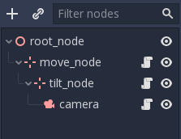

# rts-camera-godot

This script isn't exactly "plug and play" unless it is in the root node. 

### Present Features
	- Movement with 'W','A','S','D'
	- Movement with cursor when at edge of the screen, like some RTS games
	- Panning left and right with 'Q' and 'E'
	- TIliting up and down with 'R' and 'F'
	- Zoom in and out with scroll whell
	- Point and look while pressing middle mouse and dragging
	- Majority of the variables are exported to make tweaking on the go easy

### Upcoming features
	- More smooth motions to movement
	- Follow camera

### Setup
	
